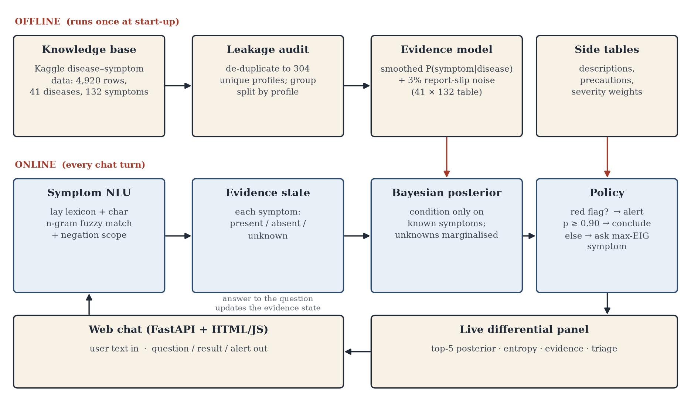
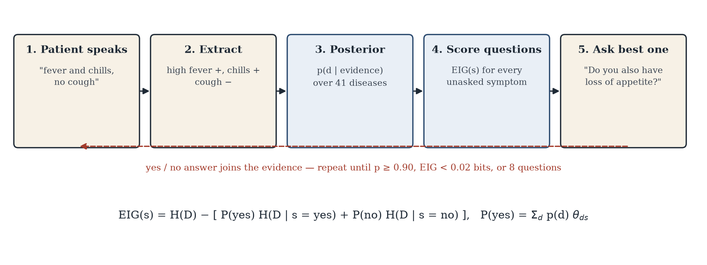
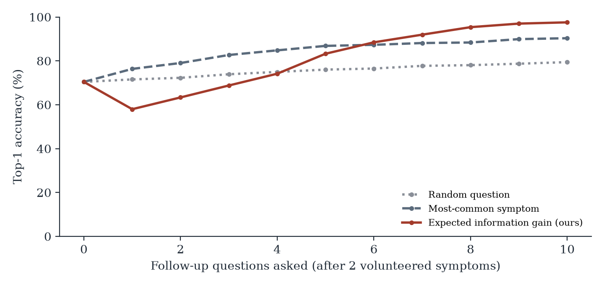
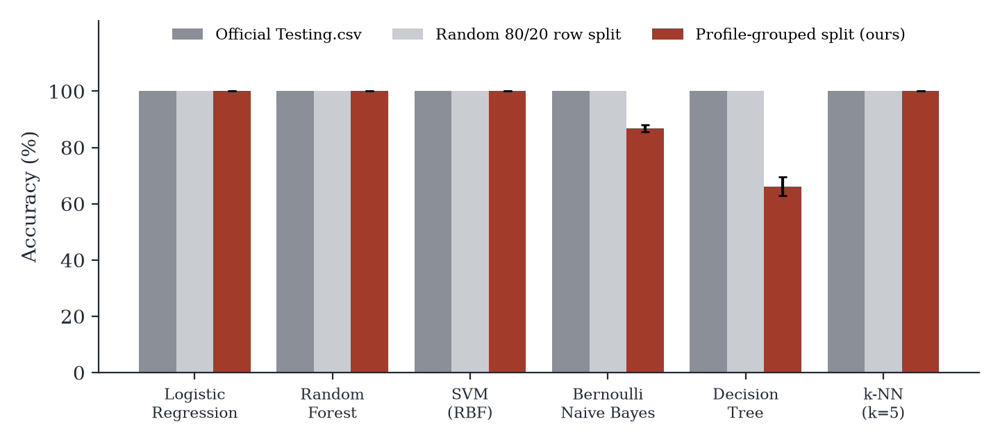
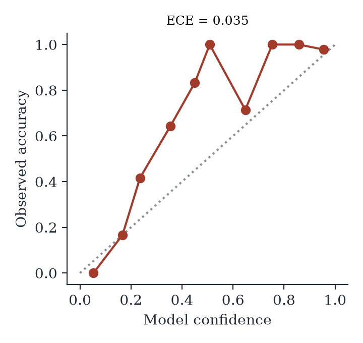

# ANAMNESIS — a medical chatbot that asks the right next question

**You tell it two or three symptoms in your own words. It works out which yes/no question would teach it the most, asks that, and stops once it's confident. Every answer comes with its reasoning.**

Project-Based Learning (Machine Learning) · Department of Computer Science and Engineering ·
Chennai Institute of Technology · 2026–2027
**Sai Charan A** (2104251040844) · **Ashfaq Muhammed A** (2104251040096)

🌐 **Live:** https://anamnesis-theta.vercel.app

> ⚕️ Not a diagnostic device. In an emergency, call **108**.

---

## The pitch in 30 seconds

Most "disease prediction" projects make the patient tick a **132-checkbox symptom form**, then report **100% accuracy**.
Both are unrealistic. A real patient says *"I have fever and my joints hurt"*, and that 100% comes from a **data leak**:
the test rows are copies of the training rows.

ANAMNESIS works the way a doctor does: **listen, ask the most useful question, decide**.

| | What it does | Measured result |
|---|---|---|
| 🎯 **Asks the best next question** | Picks the yes/no question with the highest **expected information gain** (in bits) | **96.3%** correct after about **4.0 questions** (random questions: 79.4% after 7.9) |
| 🔍 **Found a data leak** | The dataset's 4,920 rows are only **304 unique**, and **all 41 official test rows also appear in training** | Explains the "100% accuracy" everyone else reports |
| 🧠 **Reasons from partial symptoms** | A Bayesian model that only uses symptoms it **knows** about | Works from 2 symptoms, with no form to fill in |
| 💬 **Understands plain language** | "my head is pounding", "throwing up", "no fever" | F1 **0.52 → 0.95**; negation accuracy **58% → 92%** |
| 📊 **Its confidence can be trusted** | When it says 95%, it's right about 95% of the time | Calibration error (ECE) **0.035** |
| 🛑 **Knows when not to answer** | **Abstains** below 50% confidence; **red-flag alert** for danger signs | Raises an emergency alert as soon as chest pain is mentioned |
| 🚫 **Cannot make anything up** | **No generative AI model** anywhere. Every sentence is built from data | Asking about a disease it doesn't know gets a refusal, not a guess |
| ⚡ **Fast** | Choosing each question takes **0.18 ms** | Instant replies on a laptop |

**41 diseases · 132 symptoms · ~1,000 lines of Python · FastAPI + Tailwind CSS chat UI · deployed on Vercel**

---

## How it works



```
"I have a high fever and joint pain"
        │
        ▼
 ① NLU: lay terms + fuzzy matching + negation   →  high fever = YES, joint pain = YES
        │
        ▼
 ② Bayesian evidence model: posterior over 41 diseases using ONLY the known symptoms
        │              Dengue 39% · Hepatitis E 38% · ...      (uncertainty 2.55 bits)
        ▼
 ③ For every unasked symptom, compute the expected information gain
        │              "yellowing of eyes" = 0.76 bits  ← the best question
        ▼
 ④ Ask it → update → repeat, until ≥ 90% confident, OR 8 questions asked (abstain if < 50%)
        │
        ▼
 ⑤ Result + WHY (likelihood ratios) + triage level + description + precautions
```



---

## The "wow" features, explained

### 1. Expected information gain: it asks the *right* question

**The idea.** Before each question, the bot is uncertain about the disease. We measure that uncertainty as **entropy, in bits**.
For every symptom it hasn't asked about yet, it calculates:

```
EIG(symptom) = H(now) − [ P(yes) · H(after "yes") + P(no) · H(after "no") ]
```

In words: *how much uncertainty would this question remove, on average?* It asks the symptom with the **highest** value.
The UI shows this under every question: *"chosen because it is worth 0.76 bits of expected information."*

**Live example (this is the demo):** after "high fever and joint pain", **Dengue (39%)** and **Hepatitis E (38%)** are tied.
The bot asks **"yellowing of eyes?"** because that symptom separates those two diseases best (yellowing points to Hepatitis E).
That is the question a doctor would ask.

**Measured.** 1,230 simulated consultations. Each patient comes from a symptom profile the model **never saw in training**, starts with just 2 symptoms, and answers yes/no with **3% wrong answers** to imitate real patients:

| How it picks questions | Correct (top-1) | Correct (top-3) | Questions asked |
|---|---|---|---|
| Random | 79.4% | 94.8% | 7.9 |
| Most common symptom first | 90.4% | 98.5% | 5.2 |
| **Information gain (ours)** | **96.3%** | **98.7%** | **4.0** |

It is **more accurate with half as many questions** as random questioning.



**Robust to wrong answers:**

| Wrong answers | Top-1 | Questions |
|---|---|---|
| 0% | 99.4% | 3.9 |
| 3% | 96.3% | 4.0 |
| 5% | 93.8% | 4.1 |
| 10% | 87.2% | 4.2 |

Even when 1 in 10 answers is wrong, it still gets 87% right. This works because the model has a built-in "slip" probability: it expects patients to misreport sometimes.

---

### 2. The data-leak discovery: *why everyone else gets 100%*

We audited the popular Kaggle disease-symptom dataset before training anything:

- **4,920 training rows → only 304 unique.** Every profile is copied about 16 times.
- **All 41 "official test" rows also appear in the training set.** Testing on them is testing on training data.
- A random train/test split leaks the same way: **100%** of its test rows also appear in training.

So **every model scores 100%**: logistic regression, random forest, SVM, k-NN. That 100% measures memorisation, not learning.

**What we did instead:** a **profile-grouped split**, so no symptom profile appears in both training and test.
Then we tested the *real* problem: guessing the disease from **only the few symptoms a patient mentions**.

| Symptoms given | Logistic regression | Random forest | **Evidence model (ours)** |
|---|---|---|---|
| 1 | 39.8% | 46.0% | 43.3% |
| 2 | 61.8% | 61.8% | 69.8% |
| 3 | 76.0% | 76.5% | 83.7% |
| 4 | 85.9% | 85.7% | 90.2% |

From 2 symptoms, a standard classifier gets only **62%**. That's why ANAMNESIS **asks questions** instead of guessing once, which takes it to **96.3%**.



---

### 3. A Bayesian evidence model that handles "I don't know yet"

A normal classifier needs all 132 inputs filled in. If a symptom wasn't mentioned, it has to treat it as "no", which is **wrong**.

Our model keeps **three states** for each symptom: **present**, **absent** or **unknown**.
The posterior uses only the symptoms whose state is known; the unknown ones are left out of the calculation entirely:

```
P(disease | evidence) ∝ P(disease) × Π over present symptoms P(s | d) × Π over absent symptoms (1 − P(s | d))
```

- **Laplace smoothing** (α = 0.05), so an unseen symptom never sends a probability to zero.
- **3% slip rate** built in, so a single wrong answer can't wipe out the right disease.
- Because it is **generative**, it can predict how likely each answer is. That's exactly what the information-gain calculation needs, and something a discriminative classifier like logistic regression can't provide.

---

### 4. Plain-language understanding with negation

Patients don't say `headache=1, high_fever=0`. They say *"my head is pounding and I keep throwing up, no fever."*

The NLU works in three layers:
1. **Exact symptom names**, e.g. "joint pain".
2. **A hand-built lay-term lexicon**: "throwing up" → vomiting, "loose motions" → diarrhoea, "head is pounding" → headache, "short of breath" → breathlessness. It has 379 everyday phrases covering 97 symptoms, including Indian-English terms like "loose motions", "giddy" and "gas problem".
3. **Fuzzy matching** with character n-gram TF-IDF, for phrasings and spellings the lexicon misses. A single word may only fuzzy-match a single-word phrase (so a typo like "headake" still works), never part of a longer one. Without that rule, "burning" matched "burning up" (fever) and "can't breathe properly" matched "can't speak properly" (slurred speech, which set off a false stroke alarm).

**Negation scope:** "no", "not", "without", "don't have" and similar cues flip every symptom after them in the same clause to **absent**.

Measured on 50 hand-labelled patient sentences (108 symptom mentions):

| NLU version | Precision | Recall | F1 | Negation accuracy |
|---|---|---|---|---|
| Exact names only | 97.4% | 35.2% | 0.52 | 58% |
| + lay-term lexicon | 95.9% | 86.1% | 0.91 | 92% |
| **+ fuzzy n-gram (final)** | **96.2%** | **93.5%** | **0.95** | **92%** |

---

### 5. Trustworthy: calibrated, explains itself, and can abstain

- **Calibration:** the expected calibration error is **0.035**. In the top confidence bin (about 96%) it was right **97.8%** of the time (1,137 cases).

  

- **Explainable:** every result shows **why**, as likelihood ratios against the runner-up disease. For example, *"pain behind the eyes ×27.4"* means that symptom is 27 times more likely under Dengue than under the next-best disease.
- **Abstains:** if the best guess is below 50% after 8 questions, it **refuses to name one disease**. It lists the top 3 and tells the patient to see a doctor.
- **Red-flag alerts:** chest pain, breathlessness, slurred speech, one-sided weakness, blood in sputum or stool, and similar symptoms trigger an **immediate "call 108" alert** before any more questions.
- **Triage level** with every result: *Seek emergency care now*, *See a doctor within 24 hours*, or *Book a routine consultation*.

### 6. Zero hallucination by design

There is **no LLM / generative model** anywhere. Every sentence is put together from the knowledge base (disease descriptions, precautions, severity) and the model's own numbers.
Ask *"what is covid"* and it answers: *"covid isn't one of the 41 conditions in my knowledge base, so I won't guess about it."*
That matters for a medical tool: it **cannot invent a disease, a symptom or a treatment**.

---

## 🎤 Live demo script (about 6 minutes)

**Before the review:**
```bash
cd ~/projects/anamnesis
.venv/bin/uvicorn app.server:app --port 8765
```
Open **http://localhost:8765**. If it says the port is already in use, the server is already running, so just open the page.
Or use the live site, **https://anamnesis-theta.vercel.app**. It's the same app; the first message after a few idle minutes takes a few seconds while the server wakes up, so open it once before the review.

**Screen layout:** the consultation is on the left. On the right is the case board:
- **Uncertainty**: a step chart showing how many bits of uncertainty are left after each answer (hover a point to see which answer caused the drop). *This is the chart to point at.*
- **Differential (DDx)**: the top 5 of 41 conditions, with bars that re-sort live.
- **Triage**: emergency (red), see a doctor within 24 hours (amber) or routine (green).
- **Findings**: what you have (+) and don't have (−), plus every question asked with its information value.

The three example openers on the welcome screen are the demo scenarios below, so you can click them instead of typing.

Click **New consultation** before each scenario.

### Scenario 1: the main demo (information gain), about 2 min

| You type | What the app does | What you say |
|---|---|---|
| `I have a high fever and joint pain` | *Noted: joint pain; high fever.* The differential shows **Dengue 39% and Hepatitis E 38%**, nearly tied. It asks **"Do you also have yellowing of eyes?"** *(0.76 bits)* | "It understood plain English. Two diseases are almost tied, and the question it picked is the one that best separates them: yellow eyes point to hepatitis. It works out the value of every possible question, and this one is worth 0.76 bits." |
| `no` | Dengue rises to **65%**, and Hepatitis E drops out of the top 3. It asks **"pain behind the eyes?"** *(0.72 bits)* | "One answer ruled out hepatitis. Watch the bars on the right move after each answer." |
| `yes` | **Dengue 98%**, after only **2 questions**. Triage: **See a doctor within 24 hours**. *Why:* pain behind the eyes **×27.4**, joint pain **×24.8**. Description and precautions are shown | "Two questions, and it explains why. Pain behind the eyes is 27 times more likely with dengue than with the runner-up. In 1,230 simulated patients it was right 96% of the time, in 4 questions on average." |

### Scenario 2: understanding plain language and "no", about 30 sec

| You type | What the app does | What you say |
|---|---|---|
| `my head is pounding and I keep throwing up, no fever` | *Noted: headache; vomiting; no high fever.* Chips appear: **headache ✓, vomiting ✓, high fever ✗** (red) | "'Head is pounding' became headache, 'throwing up' became vomiting, and 'no fever' was recorded as a no. A plain keyword match would have said the patient *has* a fever." |

(You can stop here, or keep answering. The full conversation ends at Migraine.)

### Scenario 3: red-flag emergency, about 30 sec

| You type | What the app does | What you say |
|---|---|---|
| `I have chest pain and I'm sweating a lot, feel short of breath` | A **red alert straight away**: *"Chest pain can be a sign of something serious… call 108…"* Triage: **Seek emergency care now** | "Safety comes before the diagnosis. Danger symptoms trigger an emergency alert immediately, before any more questions." |

(If you keep answering `no`, `no`, `no`, it concludes **Heart attack 97%**.)

### Scenario 4: the second example, Malaria, about 1 min (optional)

`I have fever with chills and I'm sweating a lot` → it asks **chest pain?** (to rule out Pneumonia and TB) → `no` → **fatigue?** → `no` → **Malaria 97%**.
> "Pneumonia, TB and Malaria started at about a third each. One question about chest pain cleared it up."

### Scenario 5: no hallucinations, about 30 sec

| You type | What the app does | What you say |
|---|---|---|
| `what is malaria` | Description and precautions from the knowledge base | "It can explain any of its 41 conditions." |
| `what is covid` | *"covid isn't one of the 41 conditions in my knowledge base, so I won't guess about it."* | "There's no ChatGPT-style generator, so it cannot make anything up. For a medical tool, refusing is the correct behaviour." |

### Scenario 6: knowing when to give up (optional, about 1 min)

`I feel tired` → answer `no` to all 8 questions → it **abstains**: *"I can't narrow this down with enough confidence to name one condition…"*
> "With vague symptoms it doesn't pretend. Below 50% confidence, it refuses and sends you to a doctor."

### Then show the slides or figures
1. **`figures/fig_leakage.png`**: "Why everyone else reports 100%."
2. **`figures/fig_questions.png`**: "Information gain is the most accurate with the fewest questions."
3. **`figures/fig_calibration.png`**: "Its confidence can be trusted."

> 💡 **Demo tips:** type clean English. Small typos are fine, but heavy misspellings like "nausia" or "fatige" aren't recognised. Stick to the inputs above, which have all been tested against the live app.

---

## ❓ Questions the panel may ask

**Why not just use a classifier, like Random Forest, and get 100%?**
That 100% is fake: all 41 official test rows also appear in the training data. On unseen profiles with the 2 symptoms a real patient mentions, a classifier gets **62%**. We ask questions to get to **96%**.

**Why Naive-Bayes-style independence? Symptoms aren't independent.**
True, it's a simplification. In return we get a model that can handle **unknown** symptoms and **predict how likely each answer is**, which information gain requires. The calibration result (ECE 0.035) shows the probabilities are still reliable.

**Logistic regression trained on masked data beats your model from 2 symptoms (79.7% vs 69.8%). Why not use it?**
It's a good one-shot guesser, but it's **discriminative**: it can't tell you P(patient says yes | disease), so it **can't choose questions**. Our model is generative, so it can. After asking questions, it reaches 96.3%.

**What is "bits" / entropy?**
Uncertainty, measured in the same unit computers use. With 41 equally likely diseases the uncertainty is log₂ 41 ≈ 5.4 bits. Each good yes/no question removes up to 1 bit. The uncertainty chart shows it falling, for example 5.36 → 2.55 → 2.35 → 0.22 in the Dengue demo.

**How did you test it without real patients?**
1,230 simulated consultations. Each patient is a symptom profile the model **never trained on** (profile-grouped split, 5 random seeds), starts with 2 symptoms, and gives **3% wrong answers**. We also ran 0%, 5% and 10% noise. All of it is deterministic and reproducible with `python -m experiments.evaluate`.

**But those patients come from the same dataset. How accurate is it on realistic cases?**
We also wrote 35 textbook cases ourselves, independently of the dataset, opened them in plain English, and answered every question as a real patient would. It named the right disease in **29 of 35 (83%)** and gave up on 5 rather than guess. It named a wrong disease **only once**, and that was Rheumatoid Arthritis → Osteoarthritis, a closely related condition. The misses (Malaria, Typhoid, Gastroenteritis, Migraine, Hepatitis A) come from the public dataset's narrow symptom lists. For example, its Migraine has no nausea and its Gastroenteritis has no stomach pain, which is why real clinical data is our first item of future scope.

**What if the patient lies or makes a mistake?**
The model has a built-in 3% "slip" probability, so a single wrong answer can't eliminate the right disease. At 10% wrong answers it's still 87% accurate.

**Why didn't you use ChatGPT or an LLM?**
LLMs can **hallucinate** diseases and treatments, which is dangerous in medicine. Every sentence here comes from verified tables and the model's own maths, so it **can't make things up**. It also runs offline, free and instantly (0.18 ms per question).

**Is this a real diagnosis?**
No, and the app says so. It's a pre-consultation tool: it helps the patient describe their symptoms and decide how urgently to see a doctor (the triage level).

**What are the limitations?**
41 diseases and 132 symptoms from one public dataset. Symptoms are yes/no only (no severity or duration). Disease priors are uniform, not real-world prevalence. It hasn't been validated on real patients. **Future scope:** real prevalence priors, symptom duration and severity, Tamil/Hindi input, and validation with doctors.

---

## Run it

```bash
python -m venv .venv && source .venv/bin/activate
pip install -r requirements.txt           # the app only
uvicorn app.server:app --port 8765        # open http://localhost:8765
```

The server is stateless: the browser sends the conversation back with each message, so it runs on Vercel's serverless functions (`vercel deploy --prod`) without losing a consultation between requests.

The UI is styled with Tailwind CSS v4. After editing `app/static/index.html` or `app.js`, rebuild the stylesheet:

```bash
npm i --no-save tailwindcss@4 @tailwindcss/cli@4    # once
npx tailwindcss -i app/tailwind.css -o app/static/app.css --minify
```

### Reproduce every number and figure

```bash
pip install -r requirements-dev.txt       # matplotlib, Playwright, report tools
python -m experiments.evaluate            # writes results/results.json and figures/*.png (~90 s)
python scripts/diagrams.py                # architecture + loop diagrams
python -m playwright install chromium && python scripts/screenshots.py   # needs the server running
```

## Project layout

```
anamnesis/   knowledge.py (data + tables)  model.py (evidence model + EIG)  nlu.py (lay language + negation)  engine.py (dialogue, triage, red flags)
app/         server.py (FastAPI, stateless) + static/ (chat UI and case board) + tailwind.css (style source)
experiments/ evaluate.py (every experiment)  nlu_testset.py (50 labelled utterances)
data/raw/    Kaggle disease–symptom data + description / precaution / severity tables
results/     results.json (every number in this README)
figures/     charts, diagrams and UI screenshots
report/      PBL report (PDF + DOCX)    poster/  poster
```

**Tech:** Python · NumPy · pandas · scikit-learn · FastAPI · Uvicorn · Tailwind CSS · vanilla JS · matplotlib · Playwright · Vercel

Data: Kaggle "Disease Prediction Using Machine Learning" (kaushil268), plus the description, precaution and severity tables from github.com/itachi9604/healthcare-chatbot.
Every number above comes from `results/results.json`.
